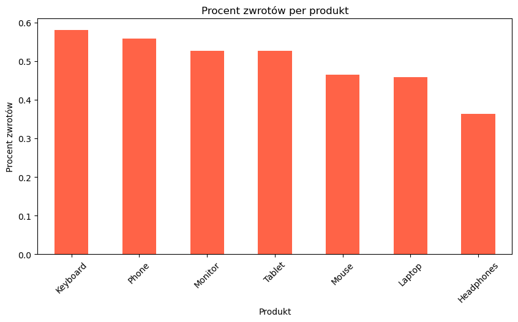
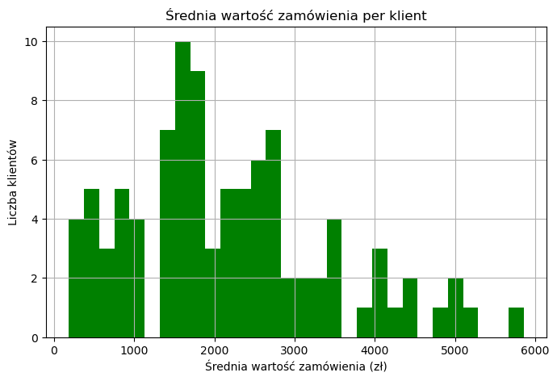
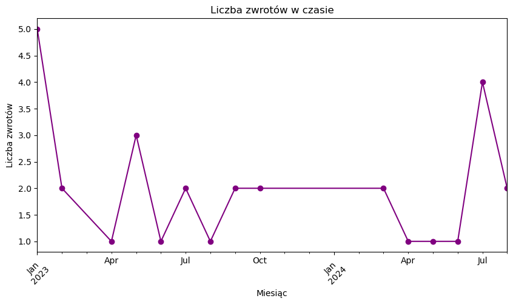
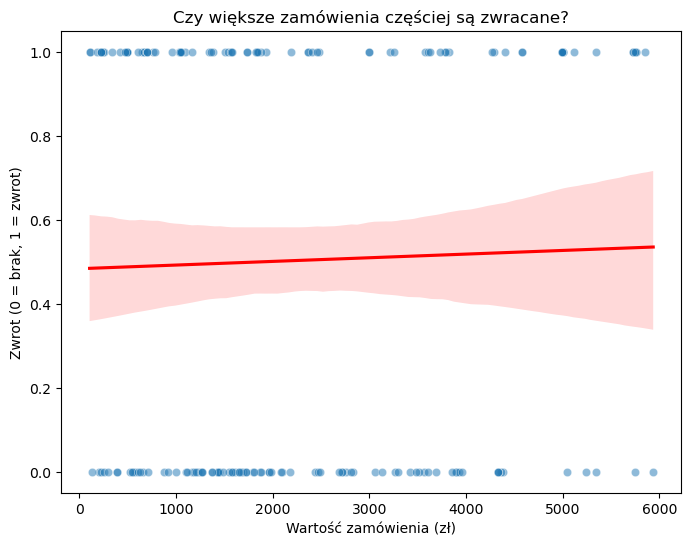
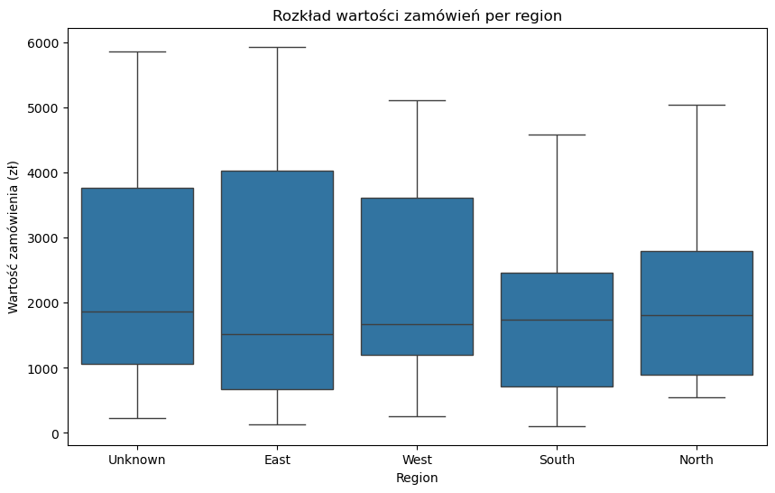
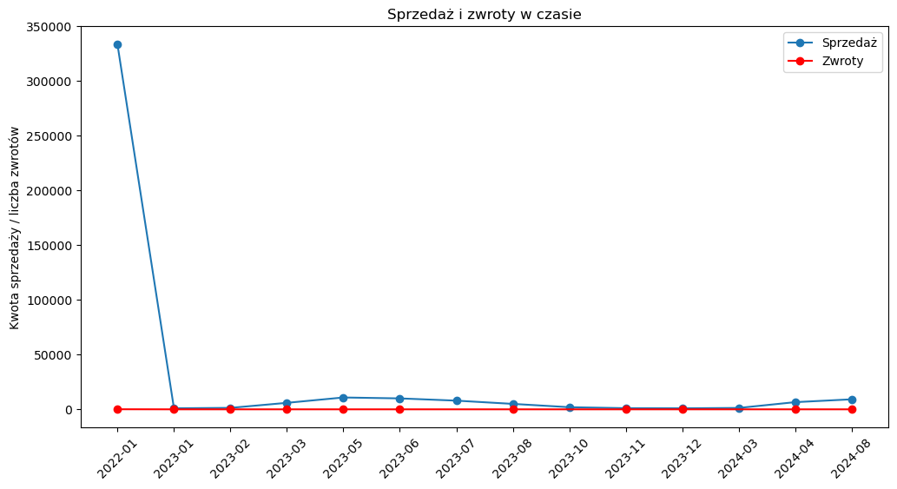
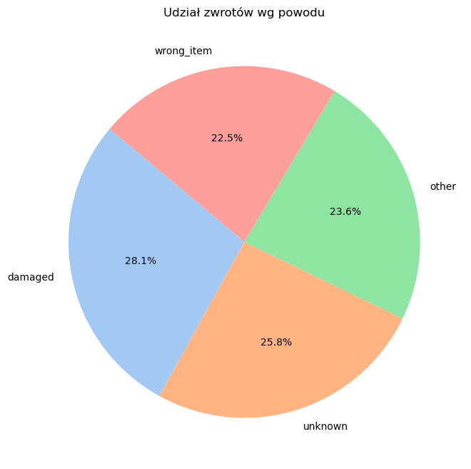

### Data loading and preliminary verification


```python
import pandas as pd

customers = pd.read_csv("customers.csv")
sales = pd.read_csv("sales.csv")
returns = pd.read_csv("returns.csv")
customers.head()


```


<div>
<style scoped>
    .dataframe tbody tr th:only-of-type {
        vertical-align: middle;
    }

    .dataframe tbody tr th {
        vertical-align: top;
    }

    .dataframe thead th {
        text-align: right;
    }
</style>
<table border="1" class="dataframe">
  <thead>
    <tr style="text-align: right;">
      <th></th>
      <th>customer_id</th>
      <th>first_name</th>
      <th>last_name</th>
      <th>email</th>
      <th>join_date</th>
      <th>region</th>
    </tr>
  </thead>
  <tbody>
    <tr>
      <th>0</th>
      <td>1</td>
      <td>Michael</td>
      <td>Miller</td>
      <td>invalid_email</td>
      <td>16/12/2020</td>
      <td>North</td>
    </tr>
    <tr>
      <th>1</th>
      <td>2</td>
      <td>Julia</td>
      <td>Miller</td>
      <td>user2@example.com</td>
      <td>26/03/2021</td>
      <td>East</td>
    </tr>
    <tr>
      <th>2</th>
      <td>3</td>
      <td>Ewa</td>
      <td>Kowalski</td>
      <td>robert3@mail.com</td>
      <td>10/01/2020</td>
      <td>NaN</td>
    </tr>
    <tr>
      <th>3</th>
      <td>4</td>
      <td>Kasia</td>
      <td>Garcia</td>
      <td>user4@example.com</td>
      <td>NaN</td>
      <td>NaN</td>
    </tr>
    <tr>
      <th>4</th>
      <td>5</td>
      <td>John</td>
      <td>Smith</td>
      <td>invalid_email</td>
      <td>NaN</td>
      <td>East</td>
    </tr>
  </tbody>
</table>
</div>


```python
from pathlib import Path
```


```python
dataset_dir = Path("dataset")
```


```python
raw_dir = dataset_dir / "raw"
processed_dir = dataset_dir / "processed"
presentation_dir = dataset_dir / "presentation"
```


```python
for folder in [dataset_dir, raw_dir, processed_dir, presentation_dir]:
    folder.mkdir(parents=True, exist_ok=True)
```


```python
print("Foldery utworzone:")
print("Główny:", dataset_dir.resolve())
print("Raw:", raw_dir.resolve())
print("Processed:", processed_dir.resolve())
```

    Foldery utworzone:
    Główny: C:\Users\szymo\dataset
    Raw: C:\Users\szymo\dataset\raw
    Processed: C:\Users\szymo\dataset\processed
    


```python
import shutil

for file_name in ["customers.csv", "sales.csv", "returns.csv"]:
    src = Path(file_name)
    dst = raw_dir / file_name
    shutil.copy(src,dst)
    print(f"Skopiowano {file_name} do {dst}")
```

    Skopiowano customers.csv do dataset\raw\customers.csv
    Skopiowano sales.csv do dataset\raw\sales.csv
    Skopiowano returns.csv do dataset\raw\returns.csv
    


```python
customers = pd.read_csv(raw_dir / "customers.csv")
sales = pd.read_csv(raw_dir / "sales.csv")
returns = pd.read_csv(raw_dir / "returns.csv")
```


```python
display(customers.head())
display(sales.head())
display(returns.head())
```


<div>
<style scoped>
    .dataframe tbody tr th:only-of-type {
        vertical-align: middle;
    }

    .dataframe tbody tr th {
        vertical-align: top;
    }

    .dataframe thead th {
        text-align: right;
    }
</style>
<table border="1" class="dataframe">
  <thead>
    <tr style="text-align: right;">
      <th></th>
      <th>customer_id</th>
      <th>first_name</th>
      <th>last_name</th>
      <th>email</th>
      <th>join_date</th>
      <th>region</th>
    </tr>
  </thead>
  <tbody>
    <tr>
      <th>0</th>
      <td>1</td>
      <td>Michael</td>
      <td>Miller</td>
      <td>invalid_email</td>
      <td>16/12/2020</td>
      <td>North</td>
    </tr>
    <tr>
      <th>1</th>
      <td>2</td>
      <td>Julia</td>
      <td>Miller</td>
      <td>user2@example.com</td>
      <td>26/03/2021</td>
      <td>East</td>
    </tr>
    <tr>
      <th>2</th>
      <td>3</td>
      <td>Ewa</td>
      <td>Kowalski</td>
      <td>robert3@mail.com</td>
      <td>10/01/2020</td>
      <td>NaN</td>
    </tr>
    <tr>
      <th>3</th>
      <td>4</td>
      <td>Kasia</td>
      <td>Garcia</td>
      <td>user4@example.com</td>
      <td>NaN</td>
      <td>NaN</td>
    </tr>
    <tr>
      <th>4</th>
      <td>5</td>
      <td>John</td>
      <td>Smith</td>
      <td>invalid_email</td>
      <td>NaN</td>
      <td>East</td>
    </tr>
  </tbody>
</table>
</div>


<div>
<style scoped>
    .dataframe tbody tr th:only-of-type {
        vertical-align: middle;
    }

    .dataframe tbody tr th {
        vertical-align: top;
    }

    .dataframe thead th {
        text-align: right;
    }
</style>
<table border="1" class="dataframe">
  <thead>
    <tr style="text-align: right;">
      <th></th>
      <th>sale_id</th>
      <th>customer_id</th>
      <th>product</th>
      <th>quantity</th>
      <th>price</th>
      <th>sale_date</th>
    </tr>
  </thead>
  <tbody>
    <tr>
      <th>0</th>
      <td>1</td>
      <td>130</td>
      <td>Keyboard</td>
      <td>2.0</td>
      <td>1914.40</td>
      <td>NaN</td>
    </tr>
    <tr>
      <th>1</th>
      <td>2</td>
      <td>148</td>
      <td>Tablet</td>
      <td>3.0</td>
      <td>1782.79</td>
      <td>NaN</td>
    </tr>
    <tr>
      <th>2</th>
      <td>3</td>
      <td>118</td>
      <td>Headphones</td>
      <td>NaN</td>
      <td>1244.25</td>
      <td>NaN</td>
    </tr>
    <tr>
      <th>3</th>
      <td>4</td>
      <td>57</td>
      <td>Keyboard</td>
      <td>1.0</td>
      <td>579.59</td>
      <td>NaN</td>
    </tr>
    <tr>
      <th>4</th>
      <td>5</td>
      <td>66</td>
      <td>Mouse</td>
      <td>1.0</td>
      <td>1097.98</td>
      <td>NaN</td>
    </tr>
  </tbody>
</table>
</div>


<div>
<style scoped>
    .dataframe tbody tr th:only-of-type {
        vertical-align: middle;
    }

    .dataframe tbody tr th {
        vertical-align: top;
    }

    .dataframe thead th {
        text-align: right;
    }
</style>
<table border="1" class="dataframe">
  <thead>
    <tr style="text-align: right;">
      <th></th>
      <th>return_id</th>
      <th>sale_id</th>
      <th>return_date</th>
      <th>reason</th>
    </tr>
  </thead>
  <tbody>
    <tr>
      <th>0</th>
      <td>1</td>
      <td>48</td>
      <td>11/11/2023</td>
      <td>wrong_item</td>
    </tr>
    <tr>
      <th>1</th>
      <td>2</td>
      <td>75</td>
      <td>10/01/2023</td>
      <td>wrong_item</td>
    </tr>
    <tr>
      <th>2</th>
      <td>3</td>
      <td>101</td>
      <td>NaN</td>
      <td>wrong_item</td>
    </tr>
    <tr>
      <th>3</th>
      <td>4</td>
      <td>167</td>
      <td>NaN</td>
      <td>other</td>
    </tr>
    <tr>
      <th>4</th>
      <td>5</td>
      <td>30</td>
      <td>NaN</td>
      <td>damaged</td>
    </tr>
  </tbody>
</table>
</div>


```python
customers.info()
```

    <class 'pandas.core.frame.DataFrame'>
    RangeIndex: 150 entries, 0 to 149
    Data columns (total 6 columns):
     #   Column       Non-Null Count  Dtype 
    ---  ------       --------------  ----- 
     0   customer_id  150 non-null    int64 
     1   first_name   150 non-null    object
     2   last_name    150 non-null    object
     3   email        108 non-null    object
     4   join_date    96 non-null     object
     5   region       104 non-null    object
    dtypes: int64(1), object(5)
    memory usage: 7.2+ KB
    


```python
display(customers.isna().sum())
```


    customer_id     0
    first_name      0
    last_name       0
    email          42
    join_date      54
    region         46
    dtype: int64


```python
display(customers.describe(include='all'))
```


<div>
<style scoped>
    .dataframe tbody tr th:only-of-type {
        vertical-align: middle;
    }

    .dataframe tbody tr th {
        vertical-align: top;
    }

    .dataframe thead th {
        text-align: right;
    }
</style>
<table border="1" class="dataframe">
  <thead>
    <tr style="text-align: right;">
      <th></th>
      <th>customer_id</th>
      <th>first_name</th>
      <th>last_name</th>
      <th>email</th>
      <th>join_date</th>
      <th>region</th>
    </tr>
  </thead>
  <tbody>
    <tr>
      <th>count</th>
      <td>150.000000</td>
      <td>150</td>
      <td>150</td>
      <td>108</td>
      <td>96</td>
      <td>104</td>
    </tr>
    <tr>
      <th>unique</th>
      <td>NaN</td>
      <td>10</td>
      <td>10</td>
      <td>65</td>
      <td>95</td>
      <td>4</td>
    </tr>
    <tr>
      <th>top</th>
      <td>NaN</td>
      <td>Robert</td>
      <td>Garcia</td>
      <td>invalid_email</td>
      <td>27/10/2022</td>
      <td>East</td>
    </tr>
    <tr>
      <th>freq</th>
      <td>NaN</td>
      <td>25</td>
      <td>19</td>
      <td>44</td>
      <td>2</td>
      <td>36</td>
    </tr>
    <tr>
      <th>mean</th>
      <td>75.500000</td>
      <td>NaN</td>
      <td>NaN</td>
      <td>NaN</td>
      <td>NaN</td>
      <td>NaN</td>
    </tr>
    <tr>
      <th>std</th>
      <td>43.445368</td>
      <td>NaN</td>
      <td>NaN</td>
      <td>NaN</td>
      <td>NaN</td>
      <td>NaN</td>
    </tr>
    <tr>
      <th>min</th>
      <td>1.000000</td>
      <td>NaN</td>
      <td>NaN</td>
      <td>NaN</td>
      <td>NaN</td>
      <td>NaN</td>
    </tr>
    <tr>
      <th>25%</th>
      <td>38.250000</td>
      <td>NaN</td>
      <td>NaN</td>
      <td>NaN</td>
      <td>NaN</td>
      <td>NaN</td>
    </tr>
    <tr>
      <th>50%</th>
      <td>75.500000</td>
      <td>NaN</td>
      <td>NaN</td>
      <td>NaN</td>
      <td>NaN</td>
      <td>NaN</td>
    </tr>
    <tr>
      <th>75%</th>
      <td>112.750000</td>
      <td>NaN</td>
      <td>NaN</td>
      <td>NaN</td>
      <td>NaN</td>
      <td>NaN</td>
    </tr>
    <tr>
      <th>max</th>
      <td>150.000000</td>
      <td>NaN</td>
      <td>NaN</td>
      <td>NaN</td>
      <td>NaN</td>
      <td>NaN</td>
    </tr>
  </tbody>
</table>
</div>


```python
print("Customers dtypes:\n", customers.dtypes)
print("Sales dtypes:\n", sales.dtypes)
print("Returns dtypes:\n", returns.dtypes)

```

    Customers dtypes:
     customer_id     int64
    first_name     object
    last_name      object
    email          object
    join_date      object
    region         object
    dtype: object
    Sales dtypes:
     sale_id          int64
    customer_id      int64
    product         object
    quantity       float64
    price          float64
    sale_date       object
    dtype: object
    Returns dtypes:
     return_id       int64
    sale_id         int64
    return_date    object
    reason         object
    dtype: object
    


```python
print("Unique customer_ids in Customers:", customers["customer_id"].nunique())
print("Unique customer_ids in Sales:", sales["customer_id"].nunique())
print("Unique return_ids in Returns:", returns["return_id"].nunique())
```

    Unique customer_ids in Customers: 150
    Unique customer_ids in Sales: 108
    Unique return_ids in Returns: 119
    


```python
print("Customers duplicates:", customers.duplicated().sum())
print("Sales duplicates:", sales.duplicated().sum())
print("Returns duplicates:", returns.duplicated().sum())
```

    Customers duplicates: 0
    Sales duplicates: 0
    Returns duplicates: 0
    


```python
print("Unique return_ids in Returns:", returns["return_id"].nunique())
```

    Unique return_ids in Returns: 119
    

### Changing data types – preparation before Merge

### Customers


```python
customers["customer_id"] = customers["customer_id"].astype("Int64")
customers["join_date"] = pd.to_datetime(customers["join_date"], errors="coerce", dayfirst=True)
```


```python
print("Customers dtypes:\n", customers.dtypes)
```

    Customers dtypes:
     customer_id             Int64
    first_name             object
    last_name              object
    email                  object
    join_date      datetime64[ns]
    region                 object
    dtype: object
    

### Sales


```python
sales["sale_id"] = sales["sale_id"].astype("Int64")
sales["customer_id"] = sales["customer_id"].astype("Int64")
sales["quantity"] = sales["quantity"].astype("float")
sales["price"] = sales["price"].astype("float")
sales["sale_date"] = pd.to_datetime(sales["sale_date"], errors="coerce", dayfirst=True, infer_datetime_format=True)
```

    C:\Users\szymo\AppData\Local\Temp\ipykernel_18388\1845805927.py:5: UserWarning: The argument 'infer_datetime_format' is deprecated and will be removed in a future version. A strict version of it is now the default, see https://pandas.pydata.org/pdeps/0004-consistent-to-datetime-parsing.html. You can safely remove this argument.
      sales["sale_date"] = pd.to_datetime(sales["sale_date"], errors="coerce", dayfirst=True, infer_datetime_format=True)
    

### Returns


```python
returns["return_id"] = returns["return_id"].astype("Int64")
returns["sale_id"] = returns["sale_id"].astype("Int64")
returns["return_date"] = pd.to_datetime(returns["return_date"], errors="coerce", dayfirst=True, infer_datetime_format=True)

```

    C:\Users\szymo\AppData\Local\Temp\ipykernel_18388\578070764.py:3: UserWarning: The argument 'infer_datetime_format' is deprecated and will be removed in a future version. A strict version of it is now the default, see https://pandas.pydata.org/pdeps/0004-consistent-to-datetime-parsing.html. You can safely remove this argument.
      returns["return_date"] = pd.to_datetime(returns["return_date"], errors="coerce", dayfirst=True, infer_datetime_format=True)
    


```python
print("Customers dtypes:\n", customers.dtypes)
print("Sales dtypes:\n", sales.dtypes)
print("Returns dtypes:\n", returns.dtypes)
```

    Customers dtypes:
     customer_id             Int64
    first_name             object
    last_name              object
    email                  object
    join_date      datetime64[ns]
    region                 object
    dtype: object
    Sales dtypes:
     sale_id                 Int64
    customer_id             Int64
    product                object
    quantity              float64
    price                 float64
    sale_date      datetime64[ns]
    dtype: object
    Returns dtypes:
     return_id               Int64
    sale_id                 Int64
    return_date    datetime64[ns]
    reason                 object
    dtype: object
    


```python
print("=== Customers ===")
print(customers.isna().sum())

print("\n=== Sales ===")
print(sales.isna().sum())

print("\n=== Returns ===")
print(returns.isna().sum())
```

    === Customers ===
    customer_id      0
    first_name       0
    last_name        0
    email           42
    join_date      100
    region          46
    dtype: int64
    
    === Sales ===
    sale_id          0
    customer_id      0
    product          0
    quantity        45
    price            0
    sale_date      170
    dtype: int64
    
    === Returns ===
    return_id       0
    sale_id         0
    return_date    77
    reason         32
    dtype: int64
    

### Checking for errors, empty fields


```python
print("=== Customers ===")
print(customers.isna().sum())

print("\n=== Sales ===")
print(sales.isna().sum())

print("\n=== Returns ===")
print(returns.isna().sum())
```

    === Customers ===
    customer_id      0
    first_name       0
    last_name        0
    email           42
    join_date      100
    region          46
    dtype: int64
    
    === Sales ===
    sale_id          0
    customer_id      0
    product          0
    quantity        45
    price            0
    sale_date      170
    dtype: int64
    
    === Returns ===
    return_id       0
    sale_id         0
    return_date    77
    reason         32
    dtype: int64
    


```python
customers[customers.isna().any(axis=1)]
```


<div>
<style scoped>
    .dataframe tbody tr th:only-of-type {
        vertical-align: middle;
    }

    .dataframe tbody tr th {
        vertical-align: top;
    }

    .dataframe thead th {
        text-align: right;
    }
</style>
<table border="1" class="dataframe">
  <thead>
    <tr style="text-align: right;">
      <th></th>
      <th>customer_id</th>
      <th>first_name</th>
      <th>last_name</th>
      <th>email</th>
      <th>join_date</th>
      <th>region</th>
    </tr>
  </thead>
  <tbody>
    <tr>
      <th>2</th>
      <td>3</td>
      <td>Ewa</td>
      <td>Kowalski</td>
      <td>robert3@mail.com</td>
      <td>2020-01-10</td>
      <td>NaN</td>
    </tr>
    <tr>
      <th>3</th>
      <td>4</td>
      <td>Kasia</td>
      <td>Garcia</td>
      <td>user4@example.com</td>
      <td>NaT</td>
      <td>NaN</td>
    </tr>
    <tr>
      <th>4</th>
      <td>5</td>
      <td>John</td>
      <td>Smith</td>
      <td>invalid_email</td>
      <td>NaT</td>
      <td>East</td>
    </tr>
    <tr>
      <th>5</th>
      <td>6</td>
      <td>Julia</td>
      <td>Nowak</td>
      <td>julia6@mail.com</td>
      <td>NaT</td>
      <td>NaN</td>
    </tr>
    <tr>
      <th>6</th>
      <td>7</td>
      <td>Tom</td>
      <td>Miller</td>
      <td>invalid_email</td>
      <td>NaT</td>
      <td>NaN</td>
    </tr>
    <tr>
      <th>...</th>
      <td>...</td>
      <td>...</td>
      <td>...</td>
      <td>...</td>
      <td>...</td>
      <td>...</td>
    </tr>
    <tr>
      <th>145</th>
      <td>146</td>
      <td>Julia</td>
      <td>Brown</td>
      <td>julia146@mail.com</td>
      <td>NaT</td>
      <td>North</td>
    </tr>
    <tr>
      <th>146</th>
      <td>147</td>
      <td>Julia</td>
      <td>Miller</td>
      <td>NaN</td>
      <td>NaT</td>
      <td>South</td>
    </tr>
    <tr>
      <th>147</th>
      <td>148</td>
      <td>Robert</td>
      <td>Davis</td>
      <td>NaN</td>
      <td>2020-05-08</td>
      <td>NaN</td>
    </tr>
    <tr>
      <th>148</th>
      <td>149</td>
      <td>John</td>
      <td>Wilson</td>
      <td>NaN</td>
      <td>NaT</td>
      <td>North</td>
    </tr>
    <tr>
      <th>149</th>
      <td>150</td>
      <td>Anna</td>
      <td>Davis</td>
      <td>invalid_email</td>
      <td>NaT</td>
      <td>NaN</td>
    </tr>
  </tbody>
</table>
<p>124 rows × 6 columns</p>
</div>


```python
(customers == "").sum()
```


    customer_id    0
    first_name     0
    last_name      0
    email          0
    join_date      0
    region         0
    dtype: Int64


```python
(returns == "").sum()
```


    return_id      0
    sale_id        0
    return_date    0
    reason         0
    dtype: Int64


```python
(sales == "").sum()
```


    sale_id        0
    customer_id    0
    product        0
    quantity       0
    price          0
    sale_date      0
    dtype: Int64


### Data Cleansing


```python
customers["email"] = customers["email"].fillna("unknown@example.com")
customers["region"] = customers["region"].fillna("Unknown")
```


```python
sales = sales.dropna(subset=["quantity"])
sales["sale_date"] = sales["sale_date"].fillna(pd.Timestamp("2022-01-01"))
```


```python
returns["reason"] = returns["reason"].fillna("unknown")
```

### Final check before merge


```python
customers["customer_id"].dtype

```


    Int64Dtype()


```python
sales["customer_id"].dtype

```


    Int64Dtype()


```python
sales["sale_id"].dtype

```


    Int64Dtype()


```python
returns["sale_id"].dtype
```


    Int64Dtype()


```python
sales["customer_id"].isna().sum()
```


    0


```python
returns["sale_id"].isna().sum()
```


    0


```python
customers["customer_id"].duplicated().sum()
```


    0


```python
customers.head(10)
```


<div>
<style scoped>
    .dataframe tbody tr th:only-of-type {
        vertical-align: middle;
    }

    .dataframe tbody tr th {
        vertical-align: top;
    }

    .dataframe thead th {
        text-align: right;
    }
</style>
<table border="1" class="dataframe">
  <thead>
    <tr style="text-align: right;">
      <th></th>
      <th>customer_id</th>
      <th>first_name</th>
      <th>last_name</th>
      <th>email</th>
      <th>join_date</th>
      <th>region</th>
    </tr>
  </thead>
  <tbody>
    <tr>
      <th>0</th>
      <td>1</td>
      <td>Michael</td>
      <td>Miller</td>
      <td>invalid_email</td>
      <td>2020-12-16</td>
      <td>North</td>
    </tr>
    <tr>
      <th>1</th>
      <td>2</td>
      <td>Julia</td>
      <td>Miller</td>
      <td>user2@example.com</td>
      <td>2021-03-26</td>
      <td>East</td>
    </tr>
    <tr>
      <th>2</th>
      <td>3</td>
      <td>Ewa</td>
      <td>Kowalski</td>
      <td>robert3@mail.com</td>
      <td>2020-01-10</td>
      <td>Unknown</td>
    </tr>
    <tr>
      <th>3</th>
      <td>4</td>
      <td>Kasia</td>
      <td>Garcia</td>
      <td>user4@example.com</td>
      <td>NaT</td>
      <td>Unknown</td>
    </tr>
    <tr>
      <th>4</th>
      <td>5</td>
      <td>John</td>
      <td>Smith</td>
      <td>invalid_email</td>
      <td>NaT</td>
      <td>East</td>
    </tr>
    <tr>
      <th>5</th>
      <td>6</td>
      <td>Julia</td>
      <td>Nowak</td>
      <td>julia6@mail.com</td>
      <td>NaT</td>
      <td>Unknown</td>
    </tr>
    <tr>
      <th>6</th>
      <td>7</td>
      <td>Tom</td>
      <td>Miller</td>
      <td>invalid_email</td>
      <td>NaT</td>
      <td>Unknown</td>
    </tr>
    <tr>
      <th>7</th>
      <td>8</td>
      <td>Anna</td>
      <td>Taylor</td>
      <td>user8@example.com</td>
      <td>NaT</td>
      <td>South</td>
    </tr>
    <tr>
      <th>8</th>
      <td>9</td>
      <td>Michael</td>
      <td>Brown</td>
      <td>user9@example.com</td>
      <td>NaT</td>
      <td>East</td>
    </tr>
    <tr>
      <th>9</th>
      <td>10</td>
      <td>Robert</td>
      <td>Lee</td>
      <td>invalid_email</td>
      <td>2023-05-31</td>
      <td>Unknown</td>
    </tr>
  </tbody>
</table>
</div>


### Merge


```python
df = pd.merge(
    sales,               
    customers,           
    on="customer_id",    
    how="left"           
)
```


```python
df = pd.merge(
    df,                  
    returns,             
    on="sale_id",        
    how="left"           
)
```


```python
print(df.head(5))
```

       sale_id  customer_id   product  quantity    price  sale_date first_name  \
    0        1          130  Keyboard       2.0  1914.40 2022-01-01        Ewa   
    1        2          148    Tablet       3.0  1782.79 2022-01-01     Robert   
    2        4           57  Keyboard       1.0   579.59 2022-01-01       Anna   
    3        5           66     Mouse       1.0  1097.98 2022-01-01      Kasia   
    4        6           91     Mouse       3.0  1467.83 2023-03-01     Robert   
    
      last_name                email  join_date   region  return_id return_date  \
    0       Lee  unknown@example.com 2022-05-30  Unknown         37  2023-01-08   
    1     Davis  unknown@example.com 2020-05-08  Unknown         59         NaT   
    2     Smith        invalid_email        NaT  Unknown       <NA>         NaT   
    3    Garcia  unknown@example.com        NaT  Unknown         93         NaT   
    4  Kowalski        invalid_email 2023-01-15  Unknown         53         NaT   
    
           reason  
    0     unknown  
    1  wrong_item  
    2         NaN  
    3       other  
    4     damaged  
    


```python
print(df.dtypes)
```

    sale_id                 Int64
    customer_id             Int64
    product                object
    quantity              float64
    price                 float64
    sale_date      datetime64[ns]
    first_name             object
    last_name              object
    email                  object
    join_date      datetime64[ns]
    region                 object
    return_id               Int64
    return_date    datetime64[ns]
    reason                 object
    dtype: object
    


```python
df.groupby("product")[["quantity", "return_id"]].count()
```


<div>
<style scoped>
    .dataframe tbody tr th:only-of-type {
        vertical-align: middle;
    }

    .dataframe tbody tr th {
        vertical-align: top;
    }

    .dataframe thead th {
        text-align: right;
    }
</style>
<table border="1" class="dataframe">
  <thead>
    <tr style="text-align: right;">
      <th></th>
      <th>quantity</th>
      <th>return_id</th>
    </tr>
    <tr>
      <th>product</th>
      <th></th>
      <th></th>
    </tr>
  </thead>
  <tbody>
    <tr>
      <th>Headphones</th>
      <td>22</td>
      <td>8</td>
    </tr>
    <tr>
      <th>Keyboard</th>
      <td>31</td>
      <td>18</td>
    </tr>
    <tr>
      <th>Laptop</th>
      <td>24</td>
      <td>11</td>
    </tr>
    <tr>
      <th>Monitor</th>
      <td>19</td>
      <td>10</td>
    </tr>
    <tr>
      <th>Mouse</th>
      <td>28</td>
      <td>13</td>
    </tr>
    <tr>
      <th>Phone</th>
      <td>34</td>
      <td>19</td>
    </tr>
    <tr>
      <th>Tablet</th>
      <td>19</td>
      <td>10</td>
    </tr>
  </tbody>
</table>
</div>


```python
df.groupby("region")[["price", "quantity"]].agg(["sum", "mean"])
```


<div>
<style scoped>
    .dataframe tbody tr th:only-of-type {
        vertical-align: middle;
    }

    .dataframe tbody tr th {
        vertical-align: top;
    }

    .dataframe thead tr th {
        text-align: left;
    }

    .dataframe thead tr:last-of-type th {
        text-align: right;
    }
</style>
<table border="1" class="dataframe">
  <thead>
    <tr>
      <th></th>
      <th colspan="2" halign="left">price</th>
      <th colspan="2" halign="left">quantity</th>
    </tr>
    <tr>
      <th></th>
      <th>sum</th>
      <th>mean</th>
      <th>sum</th>
      <th>mean</th>
    </tr>
    <tr>
      <th>region</th>
      <th></th>
      <th></th>
      <th></th>
      <th></th>
    </tr>
  </thead>
  <tbody>
    <tr>
      <th>East</th>
      <td>50405.32</td>
      <td>1050.110833</td>
      <td>102.0</td>
      <td>2.125000</td>
    </tr>
    <tr>
      <th>North</th>
      <td>16774.25</td>
      <td>1118.283333</td>
      <td>28.0</td>
      <td>1.866667</td>
    </tr>
    <tr>
      <th>South</th>
      <td>25363.16</td>
      <td>1014.526400</td>
      <td>45.0</td>
      <td>1.800000</td>
    </tr>
    <tr>
      <th>Unknown</th>
      <td>55710.47</td>
      <td>1211.097174</td>
      <td>91.0</td>
      <td>1.978261</td>
    </tr>
    <tr>
      <th>West</th>
      <td>36868.65</td>
      <td>1189.311290</td>
      <td>62.0</td>
      <td>2.000000</td>
    </tr>
  </tbody>
</table>
</div>


```python
missing_returns = df[df["return_date"].isna()]
```


```python
print(missing_returns)
```

         sale_id  customer_id     product  quantity    price  sale_date  \
    1          2          148      Tablet       3.0  1782.79 2022-01-01   
    2          4           57    Keyboard       1.0   579.59 2022-01-01   
    3          5           66       Mouse       1.0  1097.98 2022-01-01   
    4          6           91       Mouse       3.0  1467.83 2023-03-01   
    5          7           54      Tablet       3.0  1187.99 2023-05-12   
    ..       ...          ...         ...       ...      ...        ...   
    172      196           63       Mouse       2.0   905.90 2022-01-01   
    173      197          135      Laptop       3.0  1160.07 2022-01-01   
    174      198           43  Headphones       3.0   695.42 2022-01-01   
    175      199           11       Mouse       3.0  1978.74 2022-01-01   
    176      200           21       Phone       1.0  1272.44 2024-03-08   
    
        first_name last_name                email  join_date   region  return_id  \
    1       Robert     Davis  unknown@example.com 2020-05-08  Unknown         59   
    2         Anna     Smith        invalid_email        NaT  Unknown       <NA>   
    3        Kasia    Garcia  unknown@example.com        NaT  Unknown         93   
    4       Robert  Kowalski        invalid_email 2023-01-15  Unknown         53   
    5          Ewa    Wilson        invalid_email 2020-12-07     East       <NA>   
    ..         ...       ...                  ...        ...      ...        ...   
    172      Julia    Garcia   user63@example.com        NaT    North       <NA>   
    173      Julia     Davis      tom135@mail.com 2020-08-18  Unknown       <NA>   
    174     Robert    Wilson        invalid_email        NaT     West       <NA>   
    175      Julia       Lee   user11@example.com 2022-11-03     East       <NA>   
    176       Adam  Kowalski        invalid_email        NaT  Unknown       <NA>   
    
        return_date      reason  
    1           NaT  wrong_item  
    2           NaT         NaN  
    3           NaT       other  
    4           NaT     damaged  
    5           NaT         NaN  
    ..          ...         ...  
    172         NaT         NaN  
    173         NaT         NaN  
    174         NaT         NaN  
    175         NaT         NaN  
    176         NaT         NaN  
    
    [147 rows x 14 columns]
    


```python
returns_per_product = df.groupby("product")["return_id"].count() / df.groupby("product")["sale_id"].count()
print(returns_per_product)
```

    product
    Headphones    0.363636
    Keyboard      0.580645
    Laptop        0.458333
    Monitor       0.526316
    Mouse         0.464286
    Phone         0.558824
    Tablet        0.526316
    dtype: Float64
    


```python
print(df.dtypes)
```

    sale_id                 Int64
    customer_id             Int64
    product                object
    quantity              float64
    price                 float64
    sale_date      datetime64[ns]
    first_name             object
    last_name              object
    email                  object
    join_date      datetime64[ns]
    region                 object
    return_id               Int64
    return_date    datetime64[ns]
    reason                 object
    dtype: object
    


```python
df["total_value"] = df["price"] * df["quantity"]
```


```python
display(df[["sale_id", "customer_id", "product", "quantity", "price", "total_value"]].head(10))
```


<div>
<style scoped>
    .dataframe tbody tr th:only-of-type {
        vertical-align: middle;
    }

    .dataframe tbody tr th {
        vertical-align: top;
    }

    .dataframe thead th {
        text-align: right;
    }
</style>
<table border="1" class="dataframe">
  <thead>
    <tr style="text-align: right;">
      <th></th>
      <th>sale_id</th>
      <th>customer_id</th>
      <th>product</th>
      <th>quantity</th>
      <th>price</th>
      <th>total_value</th>
    </tr>
  </thead>
  <tbody>
    <tr>
      <th>0</th>
      <td>1</td>
      <td>130</td>
      <td>Keyboard</td>
      <td>2.0</td>
      <td>1914.40</td>
      <td>3828.80</td>
    </tr>
    <tr>
      <th>1</th>
      <td>2</td>
      <td>148</td>
      <td>Tablet</td>
      <td>3.0</td>
      <td>1782.79</td>
      <td>5348.37</td>
    </tr>
    <tr>
      <th>2</th>
      <td>4</td>
      <td>57</td>
      <td>Keyboard</td>
      <td>1.0</td>
      <td>579.59</td>
      <td>579.59</td>
    </tr>
    <tr>
      <th>3</th>
      <td>5</td>
      <td>66</td>
      <td>Mouse</td>
      <td>1.0</td>
      <td>1097.98</td>
      <td>1097.98</td>
    </tr>
    <tr>
      <th>4</th>
      <td>6</td>
      <td>91</td>
      <td>Mouse</td>
      <td>3.0</td>
      <td>1467.83</td>
      <td>4403.49</td>
    </tr>
    <tr>
      <th>5</th>
      <td>7</td>
      <td>54</td>
      <td>Tablet</td>
      <td>3.0</td>
      <td>1187.99</td>
      <td>3563.97</td>
    </tr>
    <tr>
      <th>6</th>
      <td>8</td>
      <td>86</td>
      <td>Mouse</td>
      <td>3.0</td>
      <td>1191.79</td>
      <td>3575.37</td>
    </tr>
    <tr>
      <th>7</th>
      <td>9</td>
      <td>105</td>
      <td>Keyboard</td>
      <td>2.0</td>
      <td>789.31</td>
      <td>1578.62</td>
    </tr>
    <tr>
      <th>8</th>
      <td>10</td>
      <td>129</td>
      <td>Laptop</td>
      <td>3.0</td>
      <td>1460.34</td>
      <td>4381.02</td>
    </tr>
    <tr>
      <th>9</th>
      <td>11</td>
      <td>48</td>
      <td>Tablet</td>
      <td>1.0</td>
      <td>499.15</td>
      <td>499.15</td>
    </tr>
  </tbody>
</table>
</div>


```python
display(df.sort_values(by="total_value", ascending=False).head(10))
```


<div>
<style scoped>
    .dataframe tbody tr th:only-of-type {
        vertical-align: middle;
    }

    .dataframe tbody tr th {
        vertical-align: top;
    }

    .dataframe thead th {
        text-align: right;
    }
</style>
<table border="1" class="dataframe">
  <thead>
    <tr style="text-align: right;">
      <th></th>
      <th>sale_id</th>
      <th>customer_id</th>
      <th>product</th>
      <th>quantity</th>
      <th>price</th>
      <th>sale_date</th>
      <th>first_name</th>
      <th>last_name</th>
      <th>email</th>
      <th>join_date</th>
      <th>region</th>
      <th>return_id</th>
      <th>return_date</th>
      <th>reason</th>
      <th>total_value</th>
    </tr>
  </thead>
  <tbody>
    <tr>
      <th>175</th>
      <td>199</td>
      <td>11</td>
      <td>Mouse</td>
      <td>3.0</td>
      <td>1978.74</td>
      <td>2022-01-01</td>
      <td>Julia</td>
      <td>Lee</td>
      <td>user11@example.com</td>
      <td>2022-11-03</td>
      <td>East</td>
      <td>&lt;NA&gt;</td>
      <td>NaT</td>
      <td>NaN</td>
      <td>5936.22</td>
    </tr>
    <tr>
      <th>99</th>
      <td>117</td>
      <td>6</td>
      <td>Mouse</td>
      <td>3.0</td>
      <td>1952.09</td>
      <td>2022-01-01</td>
      <td>Julia</td>
      <td>Nowak</td>
      <td>julia6@mail.com</td>
      <td>NaT</td>
      <td>Unknown</td>
      <td>76</td>
      <td>2023-05-28</td>
      <td>unknown</td>
      <td>5856.27</td>
    </tr>
    <tr>
      <th>25</th>
      <td>24</td>
      <td>136</td>
      <td>Tablet</td>
      <td>3.0</td>
      <td>1918.87</td>
      <td>2022-01-01</td>
      <td>Michael</td>
      <td>Nowak</td>
      <td>user136@example.com</td>
      <td>NaT</td>
      <td>East</td>
      <td>72</td>
      <td>2024-07-10</td>
      <td>other</td>
      <td>5756.61</td>
    </tr>
    <tr>
      <th>24</th>
      <td>24</td>
      <td>136</td>
      <td>Tablet</td>
      <td>3.0</td>
      <td>1918.87</td>
      <td>2022-01-01</td>
      <td>Michael</td>
      <td>Nowak</td>
      <td>user136@example.com</td>
      <td>NaT</td>
      <td>East</td>
      <td>27</td>
      <td>NaT</td>
      <td>wrong_item</td>
      <td>5756.61</td>
    </tr>
    <tr>
      <th>22</th>
      <td>22</td>
      <td>115</td>
      <td>Keyboard</td>
      <td>3.0</td>
      <td>1917.26</td>
      <td>2023-06-01</td>
      <td>Ewa</td>
      <td>Nowak</td>
      <td>user115@example.com</td>
      <td>2023-03-30</td>
      <td>East</td>
      <td>&lt;NA&gt;</td>
      <td>NaT</td>
      <td>NaN</td>
      <td>5751.78</td>
    </tr>
    <tr>
      <th>117</th>
      <td>136</td>
      <td>136</td>
      <td>Headphones</td>
      <td>3.0</td>
      <td>1916.05</td>
      <td>2022-01-01</td>
      <td>Michael</td>
      <td>Nowak</td>
      <td>user136@example.com</td>
      <td>NaT</td>
      <td>East</td>
      <td>91</td>
      <td>2023-01-10</td>
      <td>unknown</td>
      <td>5748.15</td>
    </tr>
    <tr>
      <th>110</th>
      <td>127</td>
      <td>53</td>
      <td>Laptop</td>
      <td>3.0</td>
      <td>1908.70</td>
      <td>2022-01-01</td>
      <td>Maria</td>
      <td>Smith</td>
      <td>invalid_email</td>
      <td>2024-01-09</td>
      <td>East</td>
      <td>119</td>
      <td>2024-07-06</td>
      <td>other</td>
      <td>5726.10</td>
    </tr>
    <tr>
      <th>109</th>
      <td>127</td>
      <td>53</td>
      <td>Laptop</td>
      <td>3.0</td>
      <td>1908.70</td>
      <td>2022-01-01</td>
      <td>Maria</td>
      <td>Smith</td>
      <td>invalid_email</td>
      <td>2024-01-09</td>
      <td>East</td>
      <td>44</td>
      <td>NaT</td>
      <td>unknown</td>
      <td>5726.10</td>
    </tr>
    <tr>
      <th>1</th>
      <td>2</td>
      <td>148</td>
      <td>Tablet</td>
      <td>3.0</td>
      <td>1782.79</td>
      <td>2022-01-01</td>
      <td>Robert</td>
      <td>Davis</td>
      <td>unknown@example.com</td>
      <td>2020-05-08</td>
      <td>Unknown</td>
      <td>59</td>
      <td>NaT</td>
      <td>wrong_item</td>
      <td>5348.37</td>
    </tr>
    <tr>
      <th>133</th>
      <td>150</td>
      <td>58</td>
      <td>Keyboard</td>
      <td>3.0</td>
      <td>1782.58</td>
      <td>2023-07-07</td>
      <td>Michael</td>
      <td>Smith</td>
      <td>unknown@example.com</td>
      <td>NaT</td>
      <td>Unknown</td>
      <td>&lt;NA&gt;</td>
      <td>NaT</td>
      <td>NaN</td>
      <td>5347.74</td>
    </tr>
  </tbody>
</table>
</div>


```python
df_preview = df[["sale_id", "product", "price", "quantity", "total_value"]].copy()
df_preview["total_value"] = df_preview["total_value"].map(lambda x: f"{x:,.2f} zł")
display(df_preview.head(10))
```


<div>
<style scoped>
    .dataframe tbody tr th:only-of-type {
        vertical-align: middle;
    }

    .dataframe tbody tr th {
        vertical-align: top;
    }

    .dataframe thead th {
        text-align: right;
    }
</style>
<table border="1" class="dataframe">
  <thead>
    <tr style="text-align: right;">
      <th></th>
      <th>sale_id</th>
      <th>product</th>
      <th>price</th>
      <th>quantity</th>
      <th>total_value</th>
    </tr>
  </thead>
  <tbody>
    <tr>
      <th>0</th>
      <td>1</td>
      <td>Keyboard</td>
      <td>1914.40</td>
      <td>2.0</td>
      <td>3,828.80 zł</td>
    </tr>
    <tr>
      <th>1</th>
      <td>2</td>
      <td>Tablet</td>
      <td>1782.79</td>
      <td>3.0</td>
      <td>5,348.37 zł</td>
    </tr>
    <tr>
      <th>2</th>
      <td>4</td>
      <td>Keyboard</td>
      <td>579.59</td>
      <td>1.0</td>
      <td>579.59 zł</td>
    </tr>
    <tr>
      <th>3</th>
      <td>5</td>
      <td>Mouse</td>
      <td>1097.98</td>
      <td>1.0</td>
      <td>1,097.98 zł</td>
    </tr>
    <tr>
      <th>4</th>
      <td>6</td>
      <td>Mouse</td>
      <td>1467.83</td>
      <td>3.0</td>
      <td>4,403.49 zł</td>
    </tr>
    <tr>
      <th>5</th>
      <td>7</td>
      <td>Tablet</td>
      <td>1187.99</td>
      <td>3.0</td>
      <td>3,563.97 zł</td>
    </tr>
    <tr>
      <th>6</th>
      <td>8</td>
      <td>Mouse</td>
      <td>1191.79</td>
      <td>3.0</td>
      <td>3,575.37 zł</td>
    </tr>
    <tr>
      <th>7</th>
      <td>9</td>
      <td>Keyboard</td>
      <td>789.31</td>
      <td>2.0</td>
      <td>1,578.62 zł</td>
    </tr>
    <tr>
      <th>8</th>
      <td>10</td>
      <td>Laptop</td>
      <td>1460.34</td>
      <td>3.0</td>
      <td>4,381.02 zł</td>
    </tr>
    <tr>
      <th>9</th>
      <td>11</td>
      <td>Tablet</td>
      <td>499.15</td>
      <td>1.0</td>
      <td>499.15 zł</td>
    </tr>
  </tbody>
</table>
</div>


```python
sales_summary = df.groupby("region")["total_value"].sum().reset_index()
```

### Data analysis


```python
import matplotlib.pyplot as plt
df["total_value"] = df["quantity"] * df["price"]
# 1. Procent zwrotów per produkt
returns_per_product = df.groupby("product")["return_id"].count() / df.groupby("product")["sale_id"].count()
print("Procent zwrotów per produkt:\n", returns_per_product)
# Wykres słupkowy zwrotów per produkt
plt.figure(figsize=(10,5))
returns_per_product.sort_values(ascending=False).plot(kind="bar", color="tomato")
plt.title("Procent zwrotów per produkt")
plt.ylabel("Procent zwrotów")
plt.xlabel("Produkt")
plt.xticks(rotation=45)
plt.show()
```

    Procent zwrotów per produkt:
     product
    Headphones    0.363636
    Keyboard      0.580645
    Laptop        0.458333
    Monitor       0.526316
    Mouse         0.464286
    Phone         0.558824
    Tablet        0.526316
    dtype: Float64
    


    

    


```python
# 2. Sprzedaż całkowita per region
sales_per_region = df.groupby("region")["total_value"].sum()
plt.figure(figsize=(8,5))
sales_per_region.plot(kind="bar", color="skyblue")
plt.title("Sprzedaż całkowita per region")
plt.ylabel("Łączna wartość sprzedaży (zł)")
plt.xlabel("Region")
plt.xticks(rotation=0)
plt.show()
```


    

    


```python
# 3. Średnia wartość zamówienia per klient
avg_order_per_customer = df.groupby("customer_id")["total_value"].mean()
plt.figure(figsize=(8,5))
avg_order_per_customer.hist(bins=30, color="green")
plt.title("Średnia wartość zamówienia per klient")
plt.xlabel("Średnia wartość zamówienia (zł)")
plt.ylabel("Liczba klientów")
plt.show()
```


    

    


```python
# 4. Liczba zwrotów w czasie
returns_over_time = df.dropna(subset=["return_date"]).groupby(df["return_date"].dt.to_period("M"))["return_id"].count()
plt.figure(figsize=(10,5))
returns_over_time.plot(kind="line", marker='o', color="purple")
plt.title("Liczba zwrotów w czasie")
plt.ylabel("Liczba zwrotów")
plt.xlabel("Miesiąc")
plt.xticks(rotation=45)
plt.show()
```


    

    


```python
# 5. Podgląd pierwszych 10 rekordów z formatowaniem total_value
df_preview = df[["sale_id", "product", "price", "quantity", "total_value"]].copy()
df_preview["total_value"] = df_preview["total_value"].map(lambda x: f"{x:,.2f} zł")
display(df_preview.head(10))
```


<div>
<style scoped>
    .dataframe tbody tr th:only-of-type {
        vertical-align: middle;
    }

    .dataframe tbody tr th {
        vertical-align: top;
    }

    .dataframe thead th {
        text-align: right;
    }
</style>
<table border="1" class="dataframe">
  <thead>
    <tr style="text-align: right;">
      <th></th>
      <th>sale_id</th>
      <th>product</th>
      <th>price</th>
      <th>quantity</th>
      <th>total_value</th>
    </tr>
  </thead>
  <tbody>
    <tr>
      <th>0</th>
      <td>1</td>
      <td>Keyboard</td>
      <td>1914.40</td>
      <td>2.0</td>
      <td>3,828.80 zł</td>
    </tr>
    <tr>
      <th>1</th>
      <td>2</td>
      <td>Tablet</td>
      <td>1782.79</td>
      <td>3.0</td>
      <td>5,348.37 zł</td>
    </tr>
    <tr>
      <th>2</th>
      <td>4</td>
      <td>Keyboard</td>
      <td>579.59</td>
      <td>1.0</td>
      <td>579.59 zł</td>
    </tr>
    <tr>
      <th>3</th>
      <td>5</td>
      <td>Mouse</td>
      <td>1097.98</td>
      <td>1.0</td>
      <td>1,097.98 zł</td>
    </tr>
    <tr>
      <th>4</th>
      <td>6</td>
      <td>Mouse</td>
      <td>1467.83</td>
      <td>3.0</td>
      <td>4,403.49 zł</td>
    </tr>
    <tr>
      <th>5</th>
      <td>7</td>
      <td>Tablet</td>
      <td>1187.99</td>
      <td>3.0</td>
      <td>3,563.97 zł</td>
    </tr>
    <tr>
      <th>6</th>
      <td>8</td>
      <td>Mouse</td>
      <td>1191.79</td>
      <td>3.0</td>
      <td>3,575.37 zł</td>
    </tr>
    <tr>
      <th>7</th>
      <td>9</td>
      <td>Keyboard</td>
      <td>789.31</td>
      <td>2.0</td>
      <td>1,578.62 zł</td>
    </tr>
    <tr>
      <th>8</th>
      <td>10</td>
      <td>Laptop</td>
      <td>1460.34</td>
      <td>3.0</td>
      <td>4,381.02 zł</td>
    </tr>
    <tr>
      <th>9</th>
      <td>11</td>
      <td>Tablet</td>
      <td>499.15</td>
      <td>1.0</td>
      <td>499.15 zł</td>
    </tr>
  </tbody>
</table>
</div>


```python
plt.figure(figsize=(8,6))
sns.scatterplot(
    data=df, x="total_value", y=df["return_id"].notna().astype(int),
    alpha=0.5
)
sns.regplot(
    data=df, x="total_value", y=df["return_id"].notna().astype(int),
    scatter=False, color="red"
)
plt.xlabel("Wartość zamówienia (zł)")
plt.ylabel("Zwrot (0 = brak, 1 = zwrot)")
plt.title("Czy większe zamówienia częściej są zwracane?")
plt.show()
```


    

    


```python
plt.figure(figsize=(10,6))
sns.boxplot(data=df, x="region", y="total_value")
plt.title("Rozkład wartości zamówień per region")
plt.ylabel("Wartość zamówienia (zł)")
plt.xlabel("Region")
plt.show()
```


    

    


```python
df['month'] = df['sale_date'].dt.to_period('M')

monthly_sales = df.groupby('month')['total_value'].sum()
monthly_returns = df[df['return_id'].notna()].groupby('month')['return_id'].count()

plt.figure(figsize=(12,6))
plt.plot(monthly_sales.index.astype(str), monthly_sales.values, marker='o', label='Sprzedaż')
plt.plot(monthly_returns.index.astype(str), monthly_returns.values, marker='o', label='Zwroty', color='red')
plt.xticks(rotation=45)
plt.title("Sprzedaż i zwroty w czasie")
plt.ylabel("Kwota sprzedaży / liczba zwrotów")
plt.legend()
plt.show()
```


    

    


```python
return_reasons = df['reason'].value_counts()
plt.figure(figsize=(8,8))
plt.pie(return_reasons, labels=return_reasons.index, autopct="%1.1f%%", startangle=140, colors=sns.color_palette("pastel"))
plt.title("Udział zwrotów wg powodu")
plt.show()
```


    

    


```python
top_customers = df.groupby(["customer_id", "first_name", "last_name"])["total_value"].sum().reset_index()
```


```python
top_customers = top_customers.sort_values(by="total_value", ascending=False).head()
```


```python

```


```python

```

### Save to parquet file


```python
def save_to_parquet(df, filename="sales_summary.parquet", output_dir="dataset/processed"):
    output_path = Path(output_dir)
    output_path.mkdir(parents=True, exist_ok=True)  # tworzy folder jeśli nie istnieje
    file_path = output_path / filename
    df.to_parquet(file_path, index=False)
    
    if file_path.exists():
        print("Plik zapisany:", file_path.resolve())
    else:
        print("Błąd zapisu pliku.")
    
    return file_path.resolve()
file_path = save_to_parquet(sales_summary)
```

    Plik zapisany: C:\Users\szymo\dataset\processed\sales_summary.parquet
    
